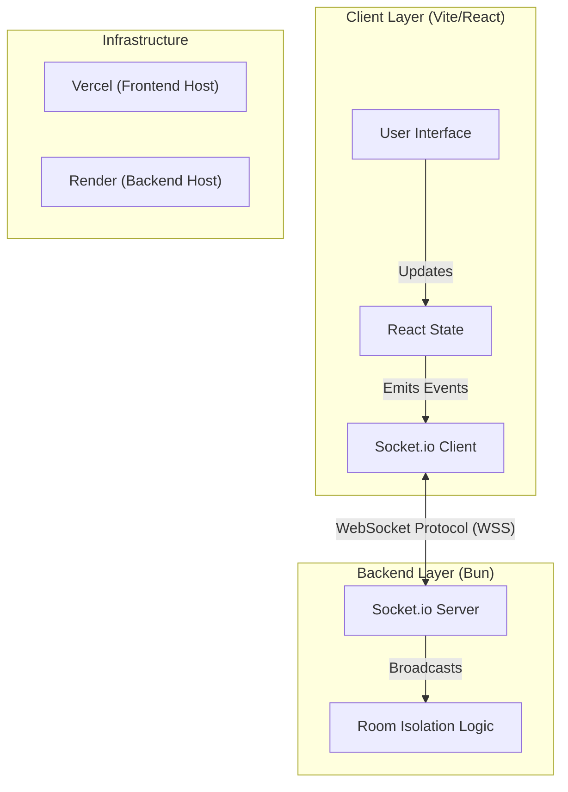
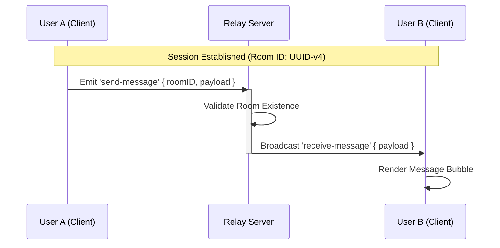

Here is a comprehensive, professional technical documentation suite for **Cross-Drop**. This version focuses on architectural clarity, precise technical specifications, and strictly adheres to a professional tone without emojis.

---

# Cross-Drop Technical Documentation

**Version:** 1.0.0
**License:** MIT
**Status:** Production Ready

## 1. Executive Summary

**Cross-Drop** is a high-performance, real-time data exchange platform designed for ephemeral communication. It facilitates secure, instant messaging and file transfer within private, isolated "rooms" without requiring persistent user accounts or database storage. The application employs a split-architecture design, utilizing **WebSockets** for low-latency signaling and data relay, ensuring a seamless user experience across devices.

## 2. System Architecture

The system operates on a decoupled Client-Server model. The frontend manages application state and UI rendering, while the backend functions as a stateless signaling relay.

### 2.1 High-Level Architecture



## 3. Technology Stack

The application leverages a modern, type-safe stack optimized for performance and developer experience.

| Layer | Component | Technology | Rationale |
| --- | --- | --- | --- |
| **Frontend** | Framework | **React 19** + **Vite** | optimized build times and efficient DOM reconciliation. |
|  | Styling | **Tailwind CSS v4** | Utility-first architecture for responsive design. |
|  | UI Primitives | **shadcn/ui** | Accessible, headless component primitives for robust UI. |
|  | Visualization | **Three.js** | 3D interactive elements (Globe visualization). |
| **Backend** | Runtime | **Bun** | High-performance JavaScript runtime. |
|  | Protocol | **Socket.io** | Reliable, event-based bidirectional communication. |
|  | API | **Express** | Minimalist web framework for routing and middleware. |
| **DevOps** | Language | **TypeScript** | Static typing for system reliability. |
|  | Build Tool | **Vite** | Next-generation frontend tooling. |

## 4. Communication Protocols

Cross-Drop utilizes an event-driven architecture. The server acts as a message broker, routing data packets to specific `roomID` namespaces.

### 4.1 Socket Event Specification

| Event Name | Type | Payload Signature | Description |
| --- | --- | --- | --- |
| `join-room` | Emission | `(roomID: string)` | Requests entry into a specific isolation channel. |
| `send-message` | Emission | `{ roomID, text, sender }` | Transmits a text payload to the server. |
| `receive-message` | Listener | `{ text, sender }` | Incoming broadcast of a message from another client. |
| `send-file` | Emission | `(meta, buffer)` | Initiates a file transfer stream via server relay. |
| `receive-file` | Listener | `(meta, buffer)` | Receives a binary file stream for reconstruction. |

### 4.2 Message Sequence Diagram

The following diagram illustrates the lifecycle of a message from the sender to the recipient.



## 5. Directory Structure

The project strictly separates concerns between the client interface and server logic.

```text
Cross-Drop/
├── client/                     # Frontend Application
│   ├── src/
│   │   ├── components/         # Reusable UI Modules
│   │   │   ├── ui/             # Shadcn Primitives (Button, Card, Input)
│   │   │   ├── Navbar.tsx      # Navigation Controller
│   │   │   └── GlobeDemo.tsx   # 3D Visualization Component
│   │   ├── routes/             # Page Controllers
│   │   │   ├── ChatRoom.tsx    # Messaging Interface
│   │   │   ├── FileRoom.tsx    # File Transfer Interface
│   │   │   └── CreateRoom.tsx  # Landing/Room Generation
│   │   └── lib/                # Utilities (Class merging, Formatting)
│   ├── vercel.json             # Routing Configuration for SPA
│   └── vite.config.ts          # Build Configuration
│
└── server/                     # Backend Application
    ├── index.ts                # Entry Point & Socket Logic
    ├── package.json            # Server Dependencies
    └── bun.lock                # Lockfile

```

## 6. Development & Installation Guide

### 6.1 Prerequisites

* **Runtime:** Node.js v18+ or Bun v1.0+
* **Package Manager:** npm, pnpm, or bun

### 6.2 Backend Setup

1. **Initialize Directory:**
```bash
cd server
bun install

```


2. **Start Development Server:**
```bash
bun dev

```


*Output:* `Server is running at http://localhost:8080`

### 6.3 Frontend Setup

1. **Initialize Directory:**
```bash
cd client
bun install

```


2. **Environment Configuration:**
Create a `.env.local` file in the `client` root:
```env
VITE_SERVER_URL=http://localhost:8080

```


3. **Start Application:**
```bash
bun run dev

```


*Output:* Access application at `http://localhost:5173`

## 7. Deployment Configuration

### 7.1 Backend (Render)

* **Build Command:** `bun install`
* **Start Command:** `bun run index.ts`
* **Environment:** Ensure the service allows external connections (0.0.0.0).

### 7.2 Frontend (Vercel)

* **Build Command:** `bun run build`
* **Output Directory:** `dist`
* **Routing:** A `vercel.json` is required to handle client-side routing rewrites.
```json
{
  "rewrites": [{ "source": "/(.*)", "destination": "/index.html" }]
}

```


---

*Documentation generated for Cross-Drop v1.0.0*
